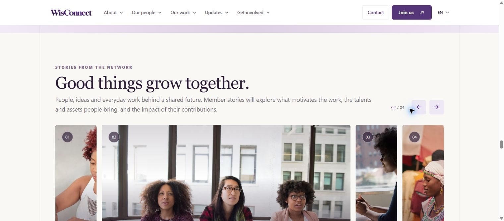
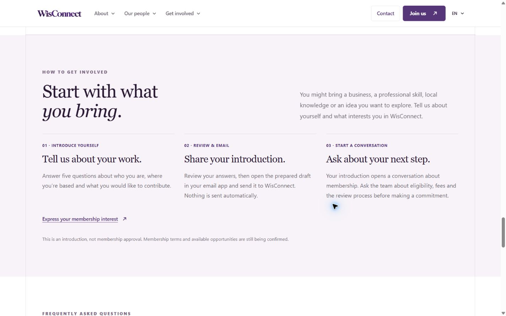
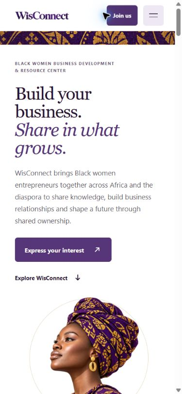

# Focused homepage preview — October 2, 2026

**Superseded shortened preview:** After review, Mitchell requested keeping the other content. All omitted homepage sections, navigation and map/story interactions have been restored. The new copy, membership introduction and FAQs remain. The eight-section layout and page-length reductions below describe the earlier preview only.

Restoration checks passed: production build, TypeScript, exact source comparison of the restored sections/story copy against HEAD, and Playwright desktop/mobile checks. All 19 sections render and every internal anchor resolves. Country selection, story navigation and reader dialog work; the 390px page fits without horizontal overflow. No submissions or deployment.

The homepage now speaks directly to Black women entrepreneurs across Africa and the diaspora: what WisConnect aims to bring together, who is shaping it, the kinds of businesses involved, and how to introduce yourself. It retains the existing purple/gold identity, hero artwork, photographic mission/vision panels, cooperative stack, profiles and sector carousel.

Eight sections replace the previous eighteen. The three-step introduction makes the existing process explicit: answer five questions, review and send the prepared draft from your own email app, then discuss membership next steps. FAQs distinguish ambitions from confirmed opportunities. Membership, partnership and general-contact actions lead to the existing Join and Contact pages. Navigation, footer and page metadata reflect the revised content. The language control displays EN; French remains marked as awaiting translation.

Pending content is deferred from the homepage, not removed from the Phase 1 scope. The former inventory and historical content remain documented in `docs/phase1-website-content.md` and Git history. No claims of guaranteed funding, scheduled programs, automatic submission, membership approval or a fixed response time were added. New copy remains a review draft.

## Validation

- Production build and TypeScript check passed.
- Source comparison against HEAD confirms all seven profiles, supplied mission/vision statements and eight sectors are unchanged.
- Playwright in connected Chrome checked desktop at 1440×900 and phone widths of 390 and 320px. No horizontal page overflow or missing internal anchor targets.
- At 1440px the homepage measured approximately 9,073px, down from 15,934px (about 43%). At 390px it measured approximately 11,778px, down from 20,108px (about 41%). Measurements vary with font loading and open FAQs.
- Desktop cooperative detail selection, Elizabeth's profile dialog/dismissal, sector carousel and membership FAQ were exercised. Mobile Get involved navigation opened and reached the three-step section, closing the menu.
- Hero membership action reached Join; partnership action reached Contact. No form, email or account mutation was submitted. Existing signed-in sessions were left alone.
- A Next.js smooth-scroll warning encountered during route checks was addressed with the documented `data-scroll-behavior="smooth"` HTML attribute.

## Preview

Local preview: http://localhost:3000/. No commit, push, publication or deployment.
